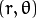
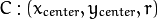
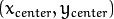
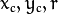

# HoughCircles

​	使用OpenCV函数 [HoughCircles](http://opencv.willowgarage.com/documentation/cpp/imgproc_feature_detection.html?#cv-houghcircles) 在图像中检测圆.

## 原理

### 霍夫圆变换

- 霍夫圆变换的基本原理和上个教程中提到的霍夫线变换类似, 只是点对应的二维极径极角空间被三维的圆心点x, y还有半径r空间取代.

- 对直线来说, 一条直线能由参数极径极角  表示. 而对圆来说, 我们需要三个参数来表示一个圆, 如上文所说现在原图像的边缘图像的任意点对应的经过这个点的所有可能圆是在三维空间有下面这三个参数来表示了，其对应一条三维空间的曲线. 那么与二维的霍夫线变换同样的道理, 对于多个边缘点越多这些点对应的三维空间曲线交于一点那么他们经过的共同圆上的点就越多，类似的我们也就可以用同样的阈值的方法来判断一个圆是否被检测到, 这就是标准霍夫圆变换的原理, 但也正是在三维空间的计算量大大增加的原因, 标准霍夫圆变化很难被应用到实际中:

  <div align=center>
    
  </div>

  这里的  表示圆心的位置 (下图中的绿点) 而  表示半径, 这样我们就能唯一的定义一个圆了, 见下图:
  
  <div align=center>
    
  </div>

- 出于上面提到的对运算效率的考虑, OpenCV实现的是一个比标准霍夫圆变换更为灵活的检测方法: *霍夫梯度法*, 也叫2-1霍夫变换(21HT), 它的原理依据是圆心一定是在圆上的每个点的模向量上, 这些圆上点模向量的交点就是圆心, 霍夫梯度法的第一步就是找到这些圆心, 这样三维的累加平面就又转化为二维累加平面. 第二部根据所有候选中心的边缘非0像素对其的支持程度来确定半径。


## 代码解释

1. 加载一幅图像

   ```c++
   src = imread("earth.jpg" argv[1]"", 1 );
   if( !src.data )
     { return -1; }
   ```

2. 转成灰度图:

   ```c++
   cvtColor( src, src_gray, CV_BGR2GRAY );
   ```

3. 执行高斯模糊以降低噪声:

   ```c++
   GaussianBlur( src_gray, src_gray, Size(9, 9), 2, 2 );
   ```

4. 执行霍夫圆变换:

   ```c++
   vector<Vec3f> circles;
   HoughCircles( src_gray, circles, CV_HOUGH_GRADIENT, 1, src_gray.rows/8, 210, 50, 0, 0 );
   ```

   函数带有以下自变量:

   - *src_gray*: 输入图像 (灰度图)
   - *circles*: 存储下面三个参数:  集合的容器来表示每个检测到的圆.
   - *CV_HOUGH_GRADIENT*: 指定检测方法. 现在OpenCV中只有霍夫梯度法
   - *dp = 1*: 累加器图像的反比分辨率
   - *min_dist = src_gray.rows/8*: 检测到圆心之间的最小距离
   - *param_1 = 200*: Canny边缘函数的高阈值
   - *param_2 = 100*: 圆心检测阈值.
   - *min_radius = 0*: 能检测到的最小圆半径, 默认为0.
   - *max_radius = 0*: 能检测到的最大圆半径, 默认为0

5. 绘出检测到的圆:

   ```c++
   for( size_t i = 0; i < circles.size(); i++ )
   {
      Point center(cvRound(circles[i][0]), cvRound(circles[i][1]));
      int radius = cvRound(circles[i][2]);
   
      circle( src, center, 3, Scalar(0,255,0), -1, 8, 0 );
   
      circle( src, center, radius, Scalar(0,0,255), 3, 8, 0 );
    }
   ```

   你将会看到圆用红色绘出而圆心用小绿点表示

6. 显示检测到的圆:

   ```c++
   namedWindow( "Hough Circle Transform Demo", CV_WINDOW_AUTOSIZE );
   imshow( "Hough Circle Transform Demo", src );
   ```

7. 等待用户按键结束程序

   ```c++
   waitKey(0);
   ```